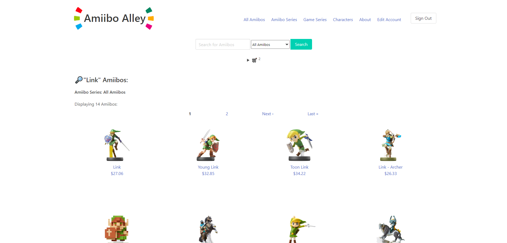

# AmiiboAlley

AmiiboAlley is an e-commerce web application built in Ruby on Rails, focusing on the data concerning currently released "Amiibo" figurines. Amiibos are NFC-enabled figurines produced by Nintendo, each based on characters from Nintendo or third-party franchises.

# Browse Our Amiibo Selection

Browse Amiibos by their Amiibo Series, Game Series, Character, or use our search functionality to find specific figures.

# Create and Manage Your Account

Save your account details for easy checkout. Account details can be changed using our edit account page.

# Add Amiibos to Your Cart

Add your purchases to the cart. You can edit quantities, or delete items here.

# Review Your Order Details

Review order details such as item quantities, subtotal, taxes charged by province, and order total.

# Simple Payment with Stripe

Procceed to Stripe to easily pay for your order by credit card. All necessary details are passed in through Amiibo Alley.

## Data Source

The data for this project is sourced from the [Amiibo API](https://amiiboapi.com/), which contains information on all currently released Amiibo figurines. The API is maintained by a developer named Nevin Nu.

## Project Details

The application retrieves data from multiple endpoints of the Amiibo API, each relating to an Amiibo Series or Game Series. The project primarily focuses on Amiibos in figurine form, excluding Amiibo cards to maintain a specific scope. Amiibos can be added to a cart and purchased.

The main goal of AmiiboDB is to provide an easily navigable platform for enthusiasts and collectors to explore and discover Amiibos, with detailed information including the character name, the series it belongs to, the game series it's associated with, and its release date, and have an opportunity to purchase them.
